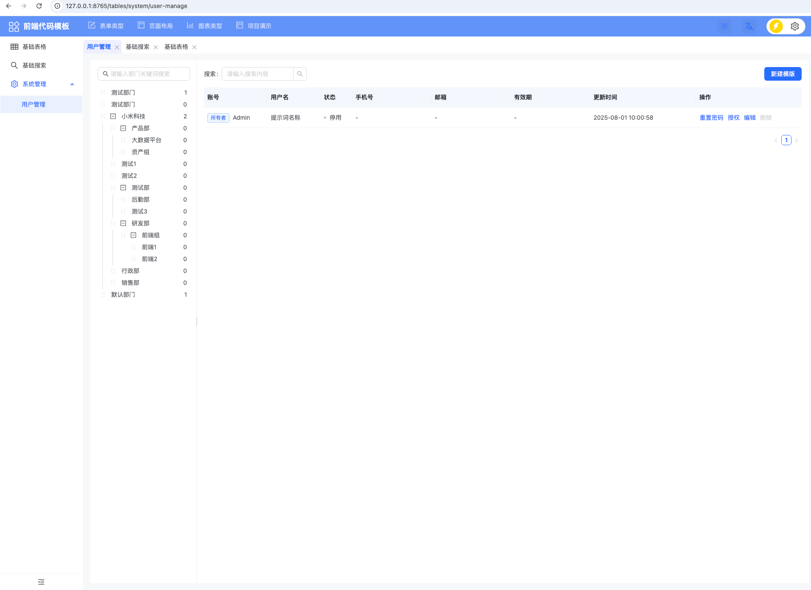

# uikit-web

## uikit 组件库

### 介绍

基于 React 的 UI 组件库，提供了丰富的基础组件和业务组件，适用于后台管理系统， 作为微前端框架的基础库。 被模块联邦的方式引入

### 使用

- 会打包部署到响应的开发环境


### 开发

```
pnpm install

pnpm start

pnpm build
``` 

### 部署

- 将部署包上传到nexus的raw资源

```
curl -v -u username:password -T uikit-web-1.0.0.tgz  https://nexus.example.com/repository/npm-group/ 
```

- 在k8s中创建deployment 的initContainer 下载资源并解压到指定目录

```
apiVersion: apps/v1
kind: Deployment
```

- 通过Ingress结合service保留remoteEntry.js的访问地址

```
apiVersion: networking.k8s.io/v1
kind: Ingress
``` 
项目

## 组件使用手册

### 说明

在线的组件使用手册，提供组件的使用说明，包括使用示例，属性说明，事件说明等。

### 开发

```
pnpm install

pnpm start

pnpm build
``` 

